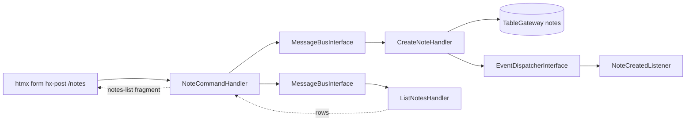

# Refactor Plan: 2.0.0-beta.1

Bump `webware/message-bus` from `1.0.0` to `2.0.0-beta.1` and `webware/messagebus-event` from
`0.1.x-dev` to `2.0.0-beta.1`, align the example app with the v2 APIs, and simplify the HTTP layer
by making it HTMX-native (the two custom middleware become obsolete).

## Why

1. This app exists to exercise `message-bus` + `messagebus-event` end to end. Both upstream packages
   ship `2.0.0-beta.1` tags (branches `2.0.x`), so the example must demonstrate current v2 usage.
2. The app is already wired for HTMX (`htmx.org@2.0.1` loaded in `layout/default.phtml`). The two
   custom middleware were added only to bridge JSON handlers to plain HTML forms:
   - `App\Middleware\MethodOverrideMiddleware` fakes `PATCH`/`DELETE` via a `_method` form field,
     because native HTML forms can only submit `GET`/`POST`.
   - `App\Middleware\NoteFormRedirectMiddleware` converts JSON responses into a Post/Redirect/Get
     flow so the browser never displays raw JSON.

   HTMX can issue real `PUT`/`PATCH`/`DELETE` requests and expects HTML fragments in response, so
   both middleware can be deleted. The `_method` fields, the second hidden delete form, and the
   `?error=` redirect banner all disappear; endpoints return fragments that HTMX swaps into the DOM.

## Upstream v2 changes that affect this code

### `webware/message-bus` (1.0.0 → 2.0.0-beta.1)

- `CommandHandlerInterface` / `QueryHandlerInterface` are now **empty marker interfaces**; v1
  declared `handle(MessageInterface $message): ResultInterface`. The invoked method is resolved
  through `StrategyInterface`; the default `HandleStrategy` calls `handle()`. Consequence: handlers
  keep their `handle()` methods, but the `#[Override]` attribute must be removed from them (the
  method no longer overrides an interface declaration; `#[Override]` would be a fatal error).
- `CommandResultInterface` now additionally extends `CommandInterface`; the concrete `CommandResult`
  / `QueryResult` constructors are unchanged.
- New `Strategy` namespace (`HandleStrategy`, `ClassnameStrategy`) plus `StrategyInterface` alias
  wiring in `ConfigProvider`. No app changes required while staying on the default strategy.
- `MessageBusInterface` now extends a new `PipelineHandlerInterface`; `handle()` behavior is
  unchanged.

### `webware/messagebus-event` (0.1.x-dev → 2.0.0-beta.1)

- Config shape used by this app is unchanged: `listeners` key
  (`EventConfigProvider::LISTENER_KEY`), command middleware pipeline priorities, event classes at
  `Webware\MessageBus\Event\Command\CommandPostHandleEvent`.
- v2 docs reverse the old EventAware recommendation: always return the library `CommandResult` /
  `QueryResult` value objects, never write a custom result class. Custom domain events are
  dispatched directly from the handler via `Psr\EventDispatcher\EventDispatcherInterface`. This
  eliminates the EventAware workaround in this repo (`App\Command\NoteCommandResult`,
  failure-notes.md #1).

## Target request flow (create note)

## Work breakdown

### Phase 1 — Dependencies

`composer.json`:

- add `"webware/message-bus": "^2.0.0-beta.1"` (direct dependency, per the v2 installation docs)
- bump `"webware/messagebus-event": "^2.0.0-beta.1"`

Run `composer update webware/message-bus webware/messagebus-event --with-all-dependencies`, then a
full `composer update`; confirm `composer.lock` and that `php-standard-library/type` constraints
remain satisfied.

### Phase 2 — v2 API alignment

- `src/App/src/CommandHandler/CreateNoteHandler.php`, `UpdateNoteHandler.php`, `DeleteNoteHandler.php`
  and `src/App/src/QueryHandler/ListNotesHandler.php`: remove `#[Override]` from `handle()`.
- Delete `src/App/src/Command/NoteCommandResult.php` (EventAware workaround, no longer needed).
- `CreateNoteHandler`: inject `EventDispatcherInterface`, dispatch `NoteCreatedEvent` directly after
  the insert, return `new CommandResult($message, MessageStatus::Success, [...])`.
- `UpdateNoteHandler` / `DeleteNoteHandler`: return
  `new CommandResult($message, $status, [...])` (`Webware\MessageBus\Command\CommandResult`).
- `src/App/src/Container/CreateNoteHandlerFactory.php`: also resolve `EventDispatcherInterface`.

### Phase 3 — HTMX refactor

Delete:

- `src/App/src/Middleware/MethodOverrideMiddleware.php`
- `src/App/src/Middleware/NoteFormRedirectMiddleware.php`

`config/pipeline.php`: remove the `MethodOverrideMiddleware` import and its `$app->pipe(...)` call.

Routes in `src/App/src/RouteProvider.php`:

| Method | Path              | Handler             | Purpose                    |
|--------|-------------------|---------------------|----------------------------|
| GET    | `/`               | `HomePageHandler`   | page shell                 |
| GET    | `/ping`           | `PingHandler`       | JSON health check          |
| GET    | `/notes`          | `NoteListHandler`   | notes list fragment        |
| POST   | `/notes`          | `NoteCommandHandler`| create, returns fragment   |
| PATCH  | `/notes/{id:\d+}` | `NoteCommandHandler`| update, returns fragment   |
| DELETE | `/notes/{id:\d+}` | `NoteCommandHandler`| delete, returns fragment   |

Handlers:

- Rename `App\Handler\NoteQueryHandler` to `NoteListHandler` (it now renders HTML, not JSON).
  Dispatches `ListNotesQuery`, renders `app::notes-list`, returns `HtmlResponse`.
- `NoteCommandHandler`: keep the `match` on request method. On success, dispatch the mutation
  command, re-dispatch `ListNotesQuery`, and render the `app::notes-list` fragment. On validation
  failure, return a `422` `HtmlResponse` rendering `app::notes-errors` with an `HX-Target:
  #notes-errors` response header so HTMX swaps the error banner instead of the list.
- `HomePageHandler`: drop the `MessageBusInterface` dependency and the `?error=` query-param
  handling; template-only. `HomePageHandlerFactory` simplifies to resolve only
  `TemplateRendererInterface`.
- Decision: `/notes` endpoints become fragment-only (JSON responses removed); `/ping` remains JSON.
  The removed middleware existed solely to adapt JSON for HTML forms; with HTMX the HTTP layer
  renders fragments directly.

Templates:

- New `src/App/templates/app/notes-list.phtml`: a `<section id="notes-list">` listing notes. Each
  note row is an update form with `hx-patch` (route `notes.update`) and a delete button with
  `hx-delete` (route `notes.delete`), both with `hx-target="#notes-list" hx-swap="outerHTML"`.
  Include the empty state ("No notes yet.").
- New `src/App/templates/app/notes-errors.phtml`: error banner fragment.
- `src/App/templates/app/home-page.phtml`: add `hx-post` + `hx-target="#notes-list"`
  + `hx-swap="outerHTML"` to the create form, with reset-on-success (`hx-on::after-request`);
  add an empty `

`; replace the server-rendered list with
  `<section id="notes-list" hx-get="..." hx-trigger="load" hx-swap="outerHTML"></section>` so the
  list loads after page load. Remove `_method` hidden fields and the separate hidden delete form.
- `src/App/src/ConfigProvider.php` `getTemplates()`: add map entries for `app::notes-list` and
  `app::notes-errors`.

### Phase 4 — ConfigProvider wiring

- Remove the `Middleware\MethodOverrideMiddleware` and `Middleware\NoteFormRedirectMiddleware`
  invokables.
- Rename the `Handler\NoteQueryHandler` factory entry to `Handler\NoteListHandler`
  (rename `Container\NoteQueryHandlerFactory` file/class to `NoteListHandlerFactory`).
- `BodyParamsMiddleware` invokable stays; form bodies still need parsing.

### Phase 5 — Tests

- `test/AppTest/CommandHandler/CreateNoteHandlerTest.php`: stub `EventDispatcherInterface`, assert
  it receives a `NoteCreatedEvent`, assert result is `CommandResult`.
- `test/AppTest/CommandHandler/UpdateNoteHandlerTest.php` / `DeleteNoteHandlerTest.php`: assert
  `CommandResult` (no EventAware coupling).
- `test/AppTest/Container/CreateNoteHandlerFactoryTest.php`: expect event dispatcher injection.
- `test/AppTest/Handler/NoteCommandHandlerTest.php`: rewrite for `HtmlResponse` + list fragment on
  success, and `422` + `HX-Target` header on validation failure, for POST/PATCH/DELETE.
- `test/AppTest/Handler/NoteQueryHandlerTest.php`: rename to `NoteListHandlerTest`, assert fragment
  rendering.
- `test/AppTest/Handler/HomePageHandlerTest.php` and `HomePageHandlerFactoryTest.php`: drop bus
  assertions.
- `test/AppTest/Container/NoteQueryHandlerFactoryTest.php`: rename to `NoteListHandlerFactoryTest`.
- `test/integration/NotesEndToEndTest.php`: unchanged; its `CommandResultInterface` /
  `QueryResultInterface` assertions remain valid in v2.

### Phase 6 — Docs

- `README.md`: update the API table (fragment responses, no JSON for `/notes`) and the Web UI
  section (HTMX forms, no `_method`, no redirect middleware).
- `docs/project-plan.md`: namespace layout, request flow diagram, routes table, files
  created/modified, and the out-of-scope note (templates now in scope).
- `docs/failure-notes.md`: annotate #1 as superseded by the v2 direct-dispatch guidance; update #2
  if the v2 `@api`/`@internal` tagging changed.

### Phase 7 — Verification

1. `composer update`
2. `composer clear-config-cache` (config caching is enabled)
3. `composer test`
4. `docker compose up -d`, then `composer test-integration`
5. Browser smoke test via `composer serve`: create a note (list updates without a page reload),
   update it, delete it, submit an empty title (error banner appears, page state preserved), and
   confirm via dev tools that requests are real `POST`/`PATCH`/`DELETE` with no `_method` field.

## Files

Deleted:

- `src/App/src/Middleware/MethodOverrideMiddleware.php`
- `src/App/src/Middleware/NoteFormRedirectMiddleware.php`
- `src/App/src/Command/NoteCommandResult.php`

Added:

- `src/App/templates/app/notes-list.phtml`
- `src/App/templates/app/notes-errors.phtml`

Modified: `composer.json`, `composer.lock`, `config/pipeline.php`,
`src/App/src/RouteProvider.php`, `src/App/src/ConfigProvider.php`, all four message
handlers, `HomePageHandler`, renamed query handler + its factory, `CreateNoteHandlerFactory`,
templates, tests, `README.md`, `docs/project-plan.md`, `docs/failure-notes.md`.

## Open decisions (recommendation in bold)

1. **Drop JSON for `/notes` entirely (fragment-only)** vs keep JSON alongside via `HX-Request`
   header content negotiation. Recommendation: fragment-only; the middleware being removed existed
   only to bridge JSON to HTML forms, and fragment-only keeps the handlers small.
2. **Keep the merged `NoteCommandHandler`** (match on method, shared list rendering) vs split into
   `NoteCreateHandler` / `NoteUpdateHandler` / `NoteDeleteHandler`. Recommendation: keep merged to
   avoid duplicated render logic; split later if a handler grows.
3. **Error UX via `HX-Target` response header + `notes-errors` fragment** vs rendering the error
   inside the swapped list fragment. Recommendation: `HX-Target` + dedicated error fragment.

## Out of scope

- Opting in to query pre/post-handle events (messagebus-event v2 feature; not needed for this demo).
- Switching to `ClassnameStrategy`.
- `php-db` / `php-db-mysql` dependency changes.
