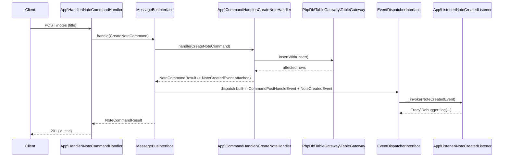

# Project Plan: MessageBus + MessageBus-Event + php-db Demo

## Purpose

This skeleton exists to exercise `webware/message-bus` and `webware/messagebus-event` end to end,
using `php-db/phpdb` + `php-db/phpdb-mysql` for persistence, and to document a working setup that can
be pointed to from those packages' own documentation. It also serves as a live example of keeping the
HTTP layer free of business logic: the two `RequestHandler`s below do nothing but translate an HTTP
request into a `Command`/`Query` message, hand it to the `MessageBus`, and translate the result back
into an HTTP response. All persistence and business rules live in `CommandHandler`/`QueryHandler`
classes that have no knowledge of PSR-7/PSR-15 and would port unchanged to another framework (CLI,
queue worker, a different HTTP framework, etc).

## Domain

A single demo entity, `Note`, backed by a `notes` table:

| Column       | Type                        | Notes                                   |
|--------------|-----------------------------|------------------------------------------|
| `id`         | `INT AUTO_INCREMENT`        | Primary key                              |
| `title`      | `VARCHAR(255)`              | User-supplied                            |
| `created_at` | `TIMESTAMP`                 | `DEFAULT CURRENT_TIMESTAMP`, set by MySQL |

## Namespace layout (module `App`, root `src/App/src`)

`App\Handler` is reserved for PSR-15 `RequestHandlerInterface` implementations (the HTTP layer). All
message-bus-facing code lives in dedicated sibling namespaces so it stays decoupled from HTTP concerns:

- `App\Handler` — PSR-15 RequestHandlers (HTTP layer only): `NoteQueryHandler`, `NoteCommandHandler`.
- `App\Command` — Command messages + result type: `CreateNoteCommand`, `UpdateNoteCommand`, `NoteCommandResult`.
- `App\Query` — Query messages: `ListNotesQuery`.
- `App\CommandHandler` — business logic for commands: `CreateNoteHandler`, `UpdateNoteHandler`.
- `App\QueryHandler` — business logic for queries: `ListNotesHandler`.
- `App\Event` — custom domain events: `NoteCreatedEvent`.
- `App\Listener` — messagebus-event listeners: `NoteCreatedListener`.
- `App\Ddl` — shared schema-creation helper: `NotesTable`.
- `App\Container` — factories for all of the above (existing project convention).

## Request flow

## Persistence approach

- A single generic `PhpDb\TableGateway\TableGateway` instance (not a custom subclass) is registered in
  the container as the `TableGateway::class` service: `new TableGateway('notes', $adapter)`.
- `CommandHandler`/`QueryHandler` classes build `PhpDb\Sql\Insert`, `PhpDb\Sql\Update`, and
  `PhpDb\Sql\Select` objects (table name `'notes'`, must match the gateway's table exactly) and execute
  them via `$gateway->insertWith()/updateWith()/selectWith()`. The last insert id comes from
  `$gateway->getLastInsertValue()`.
- Table creation uses `PhpDb\Sql\Ddl\CreateTable('notes')->ifNotExists(true)` with
  `Column\Integer`/`Column\Varchar`/`Column\Timestamp` and `Constraint\PrimaryKey`, executed via
  `(new Sql($adapter))->buildSqlString($table)` + `$adapter->query($sql, Adapter::QUERY_MODE_EXECUTE)`
  (DDL statements are not preparable). This logic lives once in `App\Ddl\NotesTable::createIfNotExists()`
  and is shared by `bin/init-notes-db.php` and the integration test bootstrap.

## MessageBus wiring

`App\ConfigProvider` registers, under `Webware\MessageBus\MessageBusInterface::class`:

- `command_map`: `CreateNoteCommand::class => CreateNoteHandler::class`,
  `UpdateNoteCommand::class => UpdateNoteHandler::class`
- `query_map`: `ListNotesQuery::class => ListNotesHandler::class`

and a top-level `listeners` key: `NoteCreatedEvent::class => [NoteCreatedListener::class]`.

`Webware\MessageBus\ConfigProvider`, `Webware\MessageBus\Event\ConfigProvider`, and
`Phly\EventDispatcher\ConfigProvider` are already registered in `config/config.php`.

## Routes

| Method | Path            | RequestHandler                  | Dispatches            |
|--------|-----------------|----------------------------------|------------------------|
| GET    | `/notes`        | `App\Handler\NoteQueryHandler`   | `ListNotesQuery`        |
| POST   | `/notes`        | `App\Handler\NoteCommandHandler` | `CreateNoteCommand`     |
| PATCH  | `/notes/{id}`   | `App\Handler\NoteCommandHandler` | `UpdateNoteCommand`     |

`NoteCommandHandler` does minimal input validation (missing/empty `title` -> `422`) before ever
touching the bus, since that's a system-boundary concern, not business logic.

## Known library issue this plan works around

See [failure-notes.md](failure-notes.md) — `webware/messagebus-event`'s own documented pattern for
attaching a custom event to a `CommandResult` (`extends CommandResult`) does not compile, because
`CommandResult` is `final`. `App\Command\NoteCommandResult` implements `CommandResultInterface` +
`EventAwareInterface` directly instead of extending the library's `CommandResult`.

## Files created

- `src/App/src/Command/CreateNoteCommand.php`
- `src/App/src/Command/UpdateNoteCommand.php`
- `src/App/src/Command/NoteCommandResult.php`
- `src/App/src/Query/ListNotesQuery.php`
- `src/App/src/Event/NoteCreatedEvent.php`
- `src/App/src/Listener/NoteCreatedListener.php`
- `src/App/src/CommandHandler/CreateNoteHandler.php`
- `src/App/src/CommandHandler/UpdateNoteHandler.php`
- `src/App/src/QueryHandler/ListNotesHandler.php`
- `src/App/src/Handler/NoteQueryHandler.php`
- `src/App/src/Handler/NoteCommandHandler.php`
- `src/App/src/Container/NotesTableGatewayFactory.php`
- `src/App/src/Container/CreateNoteHandlerFactory.php`
- `src/App/src/Container/UpdateNoteHandlerFactory.php`
- `src/App/src/Container/ListNotesHandlerFactory.php`
- `src/App/src/Container/NoteQueryHandlerFactory.php`
- `src/App/src/Container/NoteCommandHandlerFactory.php`
- `src/App/src/Ddl/NotesTable.php`
- `bin/init-notes-db.php`

## Files modified

- `src/App/src/ConfigProvider.php` — new factories/invokables, `command_map`/`query_map`, `listeners`.
- `src/App/src/RouteProvider.php` — `/notes` routes.
- `phpunit.xml.dist` — new `integration` testsuite, excluded from the default suite.

## Tests

- Unit tests (mirroring the existing `test/AppTest` conventions, using `AppTest\InMemoryContainer`) for
  every new factory, both `CommandHandler`s, `ListNotesHandler`, and both `RequestHandler`s — persistence
  is mocked via `PhpDb\TableGateway\TableGateway` (not `final`, so mockable) and `MessageBusInterface`.
- One real, docker-mysql-backed integration test (`test/integration/NotesEndToEndTest.php`) exercising
  create -> update -> list through the actual `MessageBusInterface`.

## Verification

1. `composer clear-config-cache` after config changes (config caching is enabled).
2. `docker compose up -d`, then `php bin/init-notes-db.php` — confirm the `notes` table exists
   (phpMyAdmin at `:8082`, or a MySQL client).
3. `composer test` — unit suite only (default testsuite excludes `test/integration`).
4. `composer test-integration` — requires the docker mysql container to be running.
5. Manual smoke test via `composer serve`:
   - `POST /notes {"title": "..."}` -> `201` with the new id
   - `GET /notes` -> includes the new note
   - `PATCH /notes/{id} {"title": "..."}` -> `200`
   - `PATCH /notes/999999 {"title": "..."}` -> `404`
6. Confirm Tracy's log output records a `NoteCreatedListener` entry after a `POST /notes`.

## Explicitly out of scope

- Query pre/post-handle events (messagebus-event ships them but only wires Command events by default).
- Any UI/template rendering for the `/notes` endpoints — JSON only, matching the existing `PingHandler`.
- Named/multiple database adapters — this app only ever needs one.
