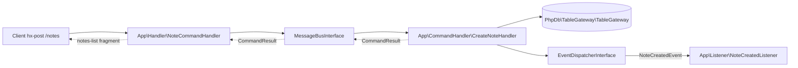

# Project Plan: MessageBus + MessageBus-Event + php-db Demo

## Purpose

This skeleton exists to exercise `webware/message-bus` and `webware/messagebus-event` end to end,
using `php-db/phpdb` + `php-db/phpdb-mysql` for persistence, and to document a working setup that can
be pointed to from those packages' own documentation. It also serves as a live example of keeping the
HTTP layer free of business logic: the `RequestHandler`s below do nothing but translate an HTTP
request into a `Command`/`Query` message, hand it to the `MessageBus`, and translate the result back
into an HTTP response (an HTMX fragment for the `/notes` routes). All persistence and business rules
live in `CommandHandler`/`QueryHandler` classes that have no knowledge of PSR-7/PSR-15 and would port
unchanged to another framework (CLI, queue worker, a different HTTP framework, etc). The UI is
HTMX-powered and the messagebus-event pipeline pre/post-handle events are logged to Tracy's
`data/log/info.log` by listeners.

## Domain

A single demo entity, `Note`, backed by a `notes` table:

| Column       | Type                        | Notes                                   |
|--------------|-----------------------------|------------------------------------------|
| `id`         | `INT AUTO_INCREMENT`        | Primary key                              |
| `title`      | `VARCHAR(255)`              | User-supplied                            |
| `created_at` | `TIMESTAMP`                 | `DEFAULT CURRENT_TIMESTAMP`, set by MySQL |

## Namespace layout (module `App`, root `src/App/src`)

`App\Handler` is reserved for PSR-15 `RequestHandlerInterface` implementations (the HTTP layer). All
message-bus-facing code lives in dedicated sibling namespaces so it stays decoupled from HTTP concerns:

- `App\Handler` — PSR-15 RequestHandlers (HTTP layer only): `NoteListHandler`, `NoteCommandHandler`,
  `HomePageHandler`.
- `App\Command` — Command messages: `CreateNoteCommand`, `UpdateNoteCommand`, `DeleteNoteCommand`.
- `App\Query` — Query messages: `ListNotesQuery`.
- `App\CommandHandler` — business logic for commands: `CreateNoteHandler`, `UpdateNoteHandler`,
  `DeleteNoteHandler`. Each declares a method named after the message's short class name
  (`createNoteCommand`, `updateNoteCommand`, `deleteNoteCommand`) per `Strategy\ClassnameStrategy`.
- `App\QueryHandler` — business logic for queries: `ListNotesHandler` (`listNotesQuery()`).
- `App\Event` — custom domain events: `NoteCreatedEvent`.
- `App\Listener` — messagebus-event listeners: `NoteCreatedListener` (domain event) and
  `MessageLifecycleListener` (command/query pre/post-handle pipeline events).
- `App\Ddl` — shared schema-creation helper: `NotesTable`.
- `App\Container` — factories for all of the above (existing project convention).

## Request flow

The pipeline dispatches `CommandPreHandleEvent` before the handler and `CommandPostHandleEvent` after
it (`webware/messagebus-event` default wiring, both logged by `MessageLifecycleListener`). The custom
`NoteCreatedEvent` is dispatched directly from the handler (the v2 pattern) and logged by
`NoteCreatedListener`:

## Persistence approach

- A single generic `PhpDb\TableGateway\TableGateway` instance (not a custom subclass) is registered in
  the container as the `TableGateway::class` service: `new TableGateway('notes', $adapter)`.
- `CommandHandler`/`QueryHandler` classes build `PhpDb\Sql\Insert`, `PhpDb\Sql\Update`, and
  `PhpDb\Sql\Select` objects (table name `'notes'`, must match the gateway's table exactly) and execute
  them via `$gateway->insertWith()/updateWith()/selectWith()`. The last insert id comes from
  `$gateway->getLastInsertValue()`.
- Table creation uses `PhpDb\Sql\Ddl\CreateTable('notes')->ifNotExists(true)` with
  `Column\Integer`/`Column\Varchar`/`Column\Timestamp` and `Constraint\PrimaryKey`, executed via
  `(new Sql($adapter))->buildSqlString($table)` + `$adapter->query($sql, Adapter::QUERY_MODE_EXECUTE)`
  (DDL statements are not preparable). This logic lives once in `App\Ddl\NotesTable::createIfNotExists()`
  and is shared by `bin/init-notes-db.php` and the integration test bootstrap.

## MessageBus wiring

`App\ConfigProvider` registers, under `Webware\MessageBus\MessageBusInterface::class`:

- `command_map`: `CreateNoteCommand::class => CreateNoteHandler::class`,
  `UpdateNoteCommand::class => UpdateNoteHandler::class`,
  `DeleteNoteCommand::class => DeleteNoteHandler::class`
- `query_map`: `ListNotesQuery::class => ListNotesHandler::class`
- `middleware_pipeline`: opts in to query events by adding `QueryPreHandleMiddleware` (priority 100)
  and `QueryPostHandleMiddleware` (priority -100). Command pre/post middleware are wired by the event
  package's own ConfigProvider by default.

plus:

- a `listeners` key: `NoteCreatedEvent::class => [NoteCreatedListener::class]` and
  `CommandPreHandleEvent` / `CommandPostHandleEvent` / `QueryPreHandleEvent` / `QueryPostHandleEvent`
  `=> [MessageLifecycleListener::class]`.
- an alias `StrategyInterface::class => Strategy\ClassnameStrategy::class` (named handler methods).

`Webware\MessageBus\ConfigProvider`, `Webware\MessageBus\Event\ConfigProvider`, and
`Phly\EventDispatcher\ConfigProvider` are already registered in `config/config.php`.

## Routes

| Method | Path            | RequestHandler                  | Dispatches             |
|--------|-----------------|----------------------------------|------------------------|
| GET    | `/`             | `App\Handler\HomePageHandler`    | (page shell)            |
| GET    | `/ping`         | `App\Handler\PingHandler`        | (JSON health check)     |
| GET    | `/notes`        | `App\Handler\NoteListHandler`    | `ListNotesQuery`        |
| POST   | `/notes`        | `App\Handler\NoteCommandHandler` | `CreateNoteCommand`     |
| PATCH  | `/notes/{id}`   | `App\Handler\NoteCommandHandler` | `UpdateNoteCommand`     |
| DELETE | `/notes/{id}`   | `App\Handler\NoteCommandHandler` | `DeleteNoteCommand`     |

The `/notes` routes render HTMX fragments (`app::notes-list` on success, `app::notes-errors` with an
`HX-Target: #notes-errors` response header on validation failure). `NoteCommandHandler` does minimal
input validation (missing/empty `title`) before ever touching the bus, since that's a system-boundary
concern, not business logic. After a successful mutation it re-dispatches `ListNotesQuery` and returns
the updated list fragment.

## Known library issue this plan works around

See [failure-notes.md](failure-notes.md) — the v1 EventAware result pattern did not compile because
`CommandResult` is `final`. With the 2.0.0-beta.1 bump the v2 pattern is used instead: handlers return
the library `CommandResult` / `QueryResult` and dispatch custom domain events directly via
`Psr\EventDispatcher\EventDispatcherInterface` (`CreateNoteHandler` dispatches `NoteCreatedEvent`).
`App\Command\NoteCommandResult` was removed.

## Files created

- `src/App/src/Command/CreateNoteCommand.php`
- `src/App/src/Command/UpdateNoteCommand.php`
- `src/App/src/Command/DeleteNoteCommand.php`
- `src/App/src/Query/ListNotesQuery.php`
- `src/App/src/Event/NoteCreatedEvent.php`
- `src/App/src/Listener/NoteCreatedListener.php`
- `src/App/src/Listener/MessageLifecycleListener.php`
- `src/App/src/CommandHandler/CreateNoteHandler.php`
- `src/App/src/CommandHandler/UpdateNoteHandler.php`
- `src/App/src/CommandHandler/DeleteNoteHandler.php`
- `src/App/src/QueryHandler/ListNotesHandler.php`
- `src/App/src/Handler/NoteListHandler.php`
- `src/App/src/Handler/NoteCommandHandler.php`
- `src/App/src/Container/NotesTableGatewayFactory.php`
- `src/App/src/Container/CreateNoteHandlerFactory.php`
- `src/App/src/Container/UpdateNoteHandlerFactory.php`
- `src/App/src/Container/DeleteNoteHandlerFactory.php`
- `src/App/src/Container/ListNotesHandlerFactory.php`
- `src/App/src/Container/NoteListHandlerFactory.php`
- `src/App/src/Container/NoteCommandHandlerFactory.php`
- `src/App/src/Ddl/NotesTable.php`
- `src/App/templates/app/notes-list.phtml`
- `src/App/templates/app/notes-errors.phtml`
- `bin/init-notes-db.php`

## Files modified

- `src/App/src/ConfigProvider.php` — factories/invokables/aliases, `command_map`/`query_map`,
  `middleware_pipeline` (query events), `listeners`, template map.
- `src/App/src/RouteProvider.php` — `/notes` routes.
- `config/pipeline.php` — removed `MethodOverrideMiddleware` (HTMX issues real PATCH/DELETE);
  added `DetectAjaxRequestMiddleware` (disables the layout for `HX-Request` requests).
- `phpunit.xml.dist` — new `integration` testsuite, excluded from the default suite.

## Tests

- Unit tests (mirroring the existing `test/AppTest` conventions, using `AppTest\InMemoryContainer`) for
  every factory, the three `CommandHandler`s, `ListNotesHandler`, the `RequestHandler`s, and both
  listeners — persistence is mocked via `PhpDb\TableGateway\TableGateway` (not `final`, so mockable)
  and `MessageBusInterface`.
- One real, docker-mysql-backed integration test (`test/integration/NotesEndToEndTest.php`) exercising
  create -> update -> list through the actual `MessageBusInterface`.

## Verification

1. `composer clear-config-cache` after config changes (config caching is enabled).
2. `docker compose up -d`, then `php bin/init-notes-db.php` — confirm the `notes` table exists
   (phpMyAdmin at `:8082`, or a MySQL client).
3. `composer test` — unit suite.
4. `composer test-integration` — requires the docker mysql container to be running.
5. Browser smoke test via `composer serve` (development mode enabled so Tracy logging works):
   - Home page loads and the notes list fills in via `hx-get` on load.
   - Add note -> list updates in place without a page reload (real `POST /notes`).
   - Update note -> `PATCH /notes/{id}`, list updates in place.
   - Delete note -> `DELETE /notes/{id}`, list updates in place.
   - Empty title -> error banner appears (`HX-Target: #notes-errors`), page state preserved.
6. Confirm `data/log/info.log` records the full pipeline after one create + list round trip:
   `CommandPreHandleEvent`, `CommandPostHandleEvent`, `QueryPreHandleEvent`,
   `QueryPostHandleEvent`, and a `NoteCreatedListener` entry.

## Explicitly out of scope

- Named/multiple database adapters — this app only ever needs one.
- Reverting the PDO-driver workaround in `mysql.local.php` until the upstream
  `Statement::__clone()` fix ships (see failure-notes.md #6).
